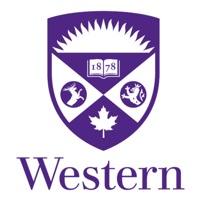

<div align="center">
  
  <h1>Western Computer Science Student Portal</h1>
  <p>Your Academic Journey, Simplified</p>

  <div>
    
    
    
  </div>
</div>

## 🚀 Features

### 📚 Course Planner
- **Multi-Year Planning**: Design your 4-year academic roadmap
- **Term Organization**: Structure courses across Fall, Winter, and Summer terms
- **Status Tracking**: Monitor course completion states in real-time
- **Dynamic Management**: Easily add/remove courses with instant updates
- **Prerequisites**: Smart prerequisite validation and requirement tracking
- **Live Updates**: Real-time status synchronization

### 📊 GPA Calculator
- **Smart Calculation**: Automatic GPA computation using Western's scale
- **Course Management**: Flexible course addition and removal
- **Persistent Storage**: Automatic saving of all GPA records
- **Weight System**: Support for different course weights
- **Live Updates**: Instant GPA recalculation as you modify grades

### 🎓 Graduation Progress
- **Degree Tracking**: Real-time monitoring of graduation requirements
- **Module Support**: Specialized tracking for Honors Computer Science
- **Visual Progress**: Clear visual indicators of completion status
- **Requirement Analysis**: Detailed view of completed and remaining requirements
- **Auto Updates**: Dynamic updates as you complete courses

### 📅 Schedule Management
- **Interactive Calendar**: User-friendly calendar interface
- **Event Types**: Support for assignments, tests, and deadlines
- **Smart Reminders**: Customizable event notifications
- **Course Filtering**: Easy filtering of events by course
- **Visual Organization**: Color-coded event categorization
- **Notification System**: Automated reminder system

### 📁 Document Repository
- **Material Management**: Centralized course material storage
- **File Support**: PDF document handling
- **Smart Search**: Quick document location
- **Course Organization**: Materials organized by course
- **Preview Feature**: Document preview before download
- **Secure Storage**: Protected document management

## 🛠️ Prerequisites

- **Node.js** (v14+)
- **CMake** (v3.10+)
- **C++ Compiler** (C++17 support)
- **Boost Library**
- **nlohmann/json Library**

## 🚀 Quick Start

### Backend Setup
```bash
# Navigate to backend
cd backend

# Enter build directory
cd build

# Generate build files
cmake ..

# Build project
make

# Start server
./server
```
Server will run on `ws://localhost:8080`

### Frontend Setup
```bash
# Navigate to frontend
cd frontend

# Install dependencies
npm install

# Start development server
npm start
```
Application opens at `http://localhost:3000`

## 📁 Project Structure
```
.
├── backend/
│   ├── include/          # C++ headers
│   ├── src/             # C++ source files
│   └── storage/         # Data persistence
├── frontend/
│   ├── public/          # Static assets
│   └── src/
│       ├── Components/  # React components
│       ├── contexts/    # React contexts
│       └── styles/      # CSS styling
```

## 🔧 Dependencies

### Backend
- **Boost.Beast**: WebSocket implementation
- **nlohmann/json**: JSON handling
- **C++17 STL**: Standard library features

### Frontend
- **React**: UI framework
- **React Router**: Navigation
- **React Icons**: UI icons
- **WebSocket API**: Real-time communication

## 💻 Development

- Backend serves WebSocket connections on port 8080
- Frontend development server runs on port 3000
- Real-time bidirectional communication via WebSocket
- File-based data persistence in backend storage
